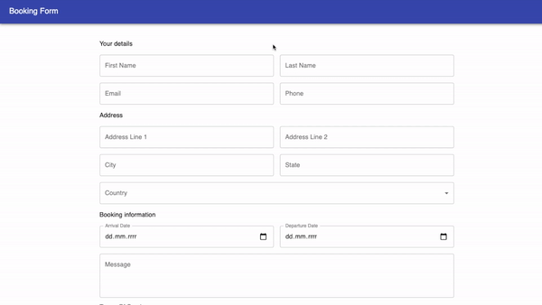

# Formik app

An extensive form with various fields to fill in supported by Formik.

<br/>



<br/>

### Live version is available [here](https://extended-form-with-formik-yup-and-material-ui.vercel.app/).

<br/>

## Table of contents

1. Technologies
2. Setup

<br/>

## 1. Technologiess

The following technologies were used in the project:

- React
- Formik
- Material-UI
- Yup

<br/>

## 2. Setup

First of all, you need to make sure you have [Node.js](https://nodejs.org/en/) installed.

If you have Node.js installed clone the github repo.

Open the project in your favourite IDE and run following script for downloading dependencies:

```
npm install
# or
yarn install
```

After that, run the development server:

```
npm start
# or
yarn start
```

Open [http://localhost:3000](http://localhost:3000) with your browser to see the result.
